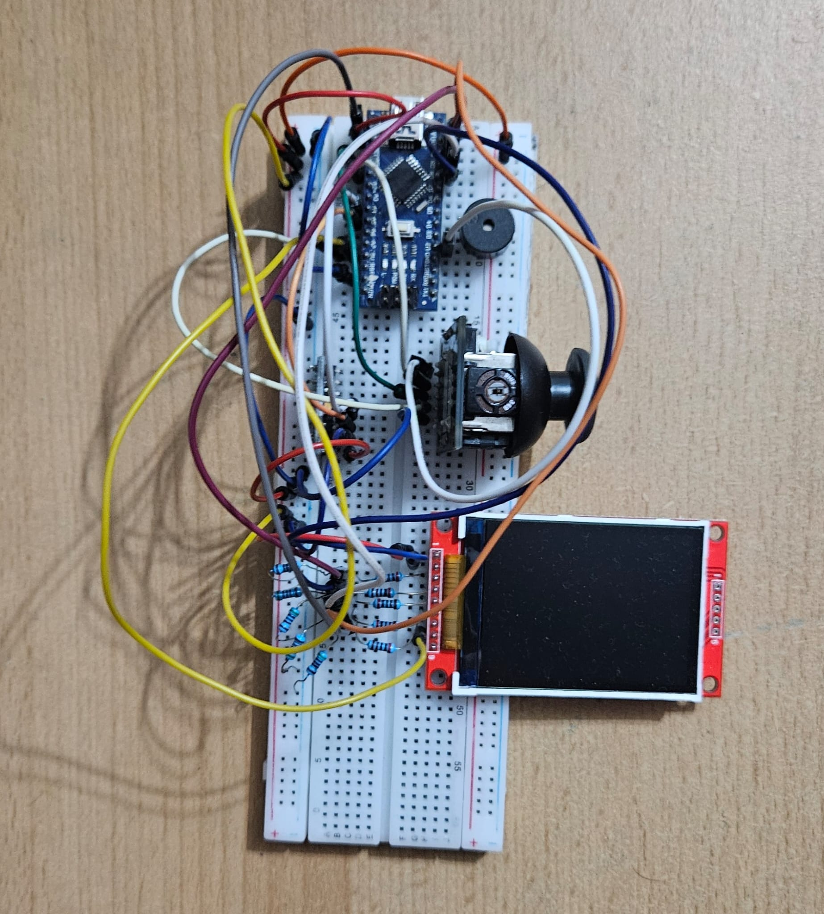

# Robotics Project - Snake Game Control with IMU and LCD

## Description

In this project, we will use an IMU sensor communicating via I2C to control the Snake game on an LCD screen using the SPI interface. The IMU sensor will detect the user's movements, and these data will be used to control the snake on the LCD screen.

---

## *Hardware Design*

### Components

| Component                          | Functionality Description                         | Documentation Link                                                                                                           |
|------------------------------------|---------------------------------------------------|-----------------------------------------------------------------------------------------------------------------------------|
| uC Nano V3.0 Atmega328             | Microcontroller for processing and control tasks | [Datasheet](https://docs.rs-online.com/4ccc/A700000011593182.pdf)                                                            |
| MPU6050 Accelerometer Gyroscope Module | Measures acceleration and angular velocity        | [Documentation](https://docs.sunfounder.com/projects/ultimate-sensor-kit/en/latest/components_basic/05-component_mpu6050.html) |
| 2.2inch Arduino SPI Module ILI9225 | Displays visual output via SPI interface          | [User Manual](http://www.lcdwiki.com/2.2inch_Arduino_SPI_Module_ILI9225_SKU%3AMAR2201)                                       |
| Analog Joystick                    | Provides directional input control                | N/A                                                                                                                         |
| Buzzer                             | Produces audio signals or alerts                  | N/A                                                                                                                         |
| Resistors                          | Control current flow and adjust signal levels     | N/A                                                                                                                         |
| Wires                              | Provide electrical connections between components | N/A                                                                                                                         |

---

### Components Used and Connections

#### 1. Arduino Nano
The **Arduino Nano** microcontroller is the core of the project, coordinating the operation of all components. It utilizes the following pins:
- **3.3V Pin**: Connected to the power rail on the breadboard to supply 3.3V to components that require it.
- **5V Pin**: Connected to the VCC pin of the joystick for power supply and to the LED pin of the LCD display to power the backlight.
- **GND Pin**: Connected to the breadboard's GND rail.
- **Digital Pins**: Used for digital components such as the LCD, and buzzer.
- **Analog Pins**: Used for I²C communication with the MPU6050 and for joystick.

---

#### 2. Analog Joystick
The analog joystick has 4 pins connected as follows:
- **VCC**: Connected directly to the 5V pin on the Arduino Nano.
- **GND**: Connected to the GND rail on the breadboard.
- **HORZ (Horizontal Axis)**: Connected to analog pin A0 on the Arduino Nano.
- **VERT (Vertical Axis)**: Connected to analog pin A1 on the Arduino Nano.

---

#### 3. Buzzer
The piezoelectric buzzer has 2 pins:
- **Positive Pin**: Connected to digital pin D4 on the Arduino Nano.
- **Negative Pin**: Connected directly to the GND pin of the Arduino Nano.

---

#### 4. IMU Module (MPU6050)
The IMU module uses I²C communication and has the following connections:
- **VCC**: Powered by the 5V rail.
- **GND**: Connected to the GND rail.
- **SDA**: Connected to A4 (I²C SDA) on the Arduino Nano.
- **SCL**: Connected to A5 (I²C SCL) on the Arduino Nano.

---

#### 5. LCD Display (ILI9341)
The LCD display uses SPI protocol and is connected as follows:
- **VCC**: Powered by the 5V rail.
- **GND**: Connected to the GND rail.
- **CS**: Connected to digital pin D10 on the Arduino Nano.
- **RST**: Connected to digital pin D8.
- **D/C**: Connected to digital pin D9.
- **MOSI**: Connected to digital pin D11.
- **SCK**: Connected to digital pin D13.
- **LED**: Powered by the 5V rail for backlight.

---

## Description of Hardware Functionality

1. **Arduino Nano**:  
   - Acts as the central microcontroller, coordinating all components.  
   - Reads input from the IMU sensor and analog joystick, processes the data, and controls output devices like the LCD display and buzzer.  

2. **Analog Joystick**:
   - Enables control of position on two axes (X and Y) through analog signals.
   - The selection button (SEL) sends a digital signal to the microcontroller.
   - Powered by 5V.

3. **Buzzer**:
   - Generates sound using PWM (Pulse Width Modulation) from digital pin D4.

4. **IMU (MPU6050)**:
   - Reads acceleration and angular velocity using the I²C interface for communication.
   - Essential for measuring motion and orientation.

5. **LCD Display (ILI9341)**:
   - Displays graphical information.
   - Uses SPI interface for fast communication with the Arduino Nano.
   - The LED pin provides backlight functionality.

6. **Resistors**:
   - Ensure circuit protection and proper functioning of analog/digital signals.

---

### Block Diagram

The block diagram illustrates the interaction between the components, including the microcontroller, IMU sensor, LCD, and other peripherals.

---

### Circuit Diagram

The circuit diagram shows the detailed electrical connections between the components in the project.

---

### Physical Circuit Photos

The following images show the physical circuit setup:

  

---

## *Software Design*

### Development Environment

- [PlatformIO](https://platformio.org/)
- [VSCode](https://code.visualstudio.com/)

### *Libraries Used*

- Wire (for I2C communication with the MPU6050)
- SPI (for communication with the ILI9341 LCD)
- Adafruit GFX Library (for graphical functions on the LCD)
- Adafruit ILI9341 (for specific control of the ILI9341 LCD)
- Adafruit MPU6050 (for handling data from the MPU6050 sensor)
- Adafruit Sensor (generic sensor handling library used by MPU6050)

### Code Description

The code reads data from the IMU sensor via I2C and updates the snake's position on the LCD screen using the SPI interface. The user's movements are translated into commands for the Snake game.
