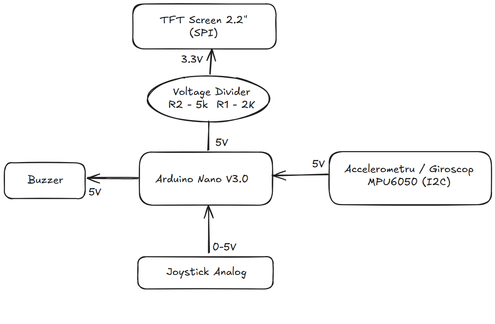
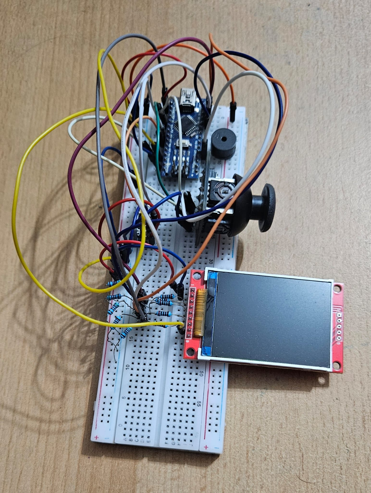

# Robotics Project - Snake Game Control with IMU and LCD

## Description

In this project, we will use an IMU sensor communicating via I2C to control the Snake game on an LCD screen using the SPI interface. The IMU sensor will detect the user's movements, and these data will be used to control the snake on the LCD screen.

---

## Hardware Design

### Components

| Component                          | Functionality Description                         | Documentation Link                                                                                                           |
|------------------------------------|---------------------------------------------------|-----------------------------------------------------------------------------------------------------------------------------|
| uC Nano V3.0 Atmega328             | Microcontroller for processing and control tasks | [Datasheet](https://docs.rs-online.com/4ccc/A700000011593182.pdf)                                                            |
| MPU6050 Accelerometer Gyroscope Module | Measures acceleration and angular velocity        | [Documentation](https://docs.sunfounder.com/projects/ultimate-sensor-kit/en/latest/components_basic/05-component_mpu6050.html) |
| 2.2inch Arduino SPI Module ILI9225 | Displays visual output via SPI interface          | [User Manual](http://www.lcdwiki.com/2.2inch_Arduino_SPI_Module_ILI9225_SKU%3AMAR2201)                                       |
| Analog Joystick                    | Provides directional input control                | N/A                                                                                                                         |
| Buzzer                             | Produces audio signals or alerts                  | N/A                                                                                                                         |
| Resistors                          | Control current flow and adjust signal levels     | N/A                                                                                                                         |
| Wires                              | Provide electrical connections between components | N/A                                                                                                                         |

---

### Components Used and Connections

#### 1. Arduino Nano
The **Arduino Nano** microcontroller is the core of the project, coordinating the operation of all components. It utilizes the following pins:
- **3.3V Pin**: Connected to the power rail on the breadboard to supply 3.3V to components that require it.
- **5V Pin**: Connected to the VCC pin of the joystick for power supply and to the LED pin of the LCD display to power the backlight.
- **GND Pin**: Connected to the breadboard's GND rail.
- **Digital Pins**: Used for digital components such as the LCD, and buzzer.
- **Analog Pins**: Used for I²C communication with the MPU6050 and for joystick.

#### 2. Analog Joystick
The analog joystick has 4 pins connected as follows:
- **VCC**: Connected directly to the 5V pin on the Arduino Nano.
- **GND**: Connected to the GND rail on the breadboard.
- **HORZ (Horizontal Axis)**: Connected to analog pin A0 on the Arduino Nano.
- **VERT (Vertical Axis)**: Connected to analog pin A1 on the Arduino Nano.

#### 3. Buzzer
The piezoelectric buzzer has 2 pins:
- **Positive Pin**: Connected to digital pin D4 on the Arduino Nano.
- **Negative Pin**: Connected directly to the GND pin of the Arduino Nano.

#### 4. IMU Module (MPU6050)
The IMU module uses I²C communication and has the following connections:
- **VCC**: Powered by the 5V rail.
- **GND**: Connected to the GND rail.
- **SDA**: Connected to A4 (I²C SDA) on the Arduino Nano.
- **SCL**: Connected to A5 (I²C SCL) on the Arduino Nano.

#### 5. LCD Display (ILI9341)
The LCD display uses SPI protocol and is connected as follows:
- **VCC**: Powered by the 5V rail.
- **GND**: Connected to the GND rail.
- **CS**: Connected to digital pin D10 on the Arduino Nano.
- **RST**: Connected to digital pin D8.
- **D/C**: Connected to digital pin D9.
- **MOSI**: Connected to digital pin D11.
- **SCK**: Connected to digital pin D13.
- **LED**: Powered by the 5V rail for backlight.

---

## Description of Hardware Functionality

### 1. Arduino Nano
- Acts as the central microcontroller, coordinating all components.  
- Reads input from the IMU sensor and analog joystick, processes the data, and controls output devices like the LCD display and buzzer.  

### 2. Analog Joystick
- Enables control of position on two axes (X and Y) through analog signals.
- The selection button (SEL) sends a digital signal to the microcontroller.
- Powered by 5V.

### 3. Buzzer
- Generates sound using PWM (Pulse Width Modulation) from digital pin D4.

### 4. IMU (MPU6050)
- Reads acceleration and angular velocity using the I²C interface for communication.
- Essential for measuring motion and orientation.

### 5. LCD Display (ILI9341)
- Displays graphical information.
- Uses SPI interface for fast communication with the Arduino Nano.
- The LED pin provides backlight functionality.

### 6. Resistors
- Ensure circuit protection and proper functioning of analog/digital signals.

---

## Block Diagram

The block diagram illustrates the interaction between the components, including the microcontroller, IMU sensor, LCD, and other peripherals.

---

## Circuit Diagram

The circuit diagram shows the detailed electrical connections between the components in the project.

---

## Physical Circuit Photos

The following images show the physical circuit setup:

  

---

## Software Design

### Development Environment  
**Development Board:** Arduino NANO  
**Libraries Used:**
- **Adafruit GFX Library**: Provides advanced graphics utilities for the display.  
- **Adafruit ILI9341**: For graphical display handling on the TFT screen.  
- **Adafruit MPU6050**: For accelerometer and gyroscope handling.  
- **Adafruit Sensor**: Provides unified sensor interface for MPU6050.  
- **adafruit/Adafruit BusIO**: For I2C and SPI communication with peripherals.  

---

## Functionality Overview

### 1. Menu System
- **Menu Navigation:**
  - Joystick controls to navigate between options: Play, Difficulty, Debug, Exit.  
  - Joystick press confirms selection.  
- **Game Over Screen:** Displays a "Game Over" message when the player loses, along with sound feedback.  

### 2. Gameplay Logic
- **Snake Movement:**  
  - Controlled by joystick or accelerometer.  
  - Collision detection for screen boundaries and the snake’s body.  
- **Fruit Handling:**  
  - Randomly spawns food on the screen.  
  - Eating food increases the snake’s score.  
- **Difficulty Levels:**  
  - Configurable via the menu (`Easy`, `Medium`, `Hard`).  
  - Affects the number of lives and game speed.  
- **Lives and Reset:**
  - After a collision, if lives remain, the game resets the snake’s position and continues.  
  - If no lives remain, the game displays a "Game Over" screen.  

### 3. Debug Mode
- **Sensor Data:**  
  - Displays accelerometer and gyroscope readings in real-time.  
  - Indicates movement direction based on sensor data.

### 4. Sound Effects
- **Buzzer Feedback:**  
  - **Game Over:** Plays a sequence of tones when the game ends.  
  - **Fruit Collection:** Emits a short tone when the player collects a fruit.  

---

## Implementation Details

### Key Classes and Functions

#### `LCD`
- Manages TFT display initialization and operations.  
- Key Methods:  
  - `initLCD()`: Initializes the screen.  
  - `clearScreen()`: Clears the display.  

#### `Joystick`
- Handles joystick input for movement and selection.  
- Key Methods:  
  - `readX()` and `readY()`: Read analog signals for directional input.  
  - `isButtonPressed()`: Detects joystick button press.

#### `Gyro`
- Interfaces with the MPU6050 sensor for accelerometer and gyroscope data.  
- Key Methods:  
  - `initGyro()`: Initializes the sensor.  
  - `readAccel()`: Fetches acceleration data and compensates for gravity.  
  - `readGyro()`: Fetches rotational data.

#### `Menu`
- Handles menu rendering and navigation.  
- Key Methods:  
  - `displayMenu()`: Displays the menu options.  
  - `navigate(direction)`: Updates the current menu option.  
  - `selectOption()`: Confirms the current selection.  
  - `displayGameOver()`: Displays the "Game Over" screen.

#### `Snake`
- Core gameplay logic.  
- Key Methods:  
  - `move(direction)`: Updates snake position based on input.  
  - `checkCollision()`: Checks for collisions with boundaries or itself.  
  - `checkFruitCollision()`: Detects when food is eaten and updates the game state.  
  - `update()`: Renders the snake, food, score, and lives.  
  - `placeFruit()`: Randomly places food on the screen.

#### `drawHeart`
- Utility function to render heart symbols on the screen to represent lives.  

---

## Game Flow

### 1. Startup
- Initializes hardware components (TFT, joystick, MPU6050).  
- Displays the main menu.  

### 2. Menu Navigation
- Navigate between `Play`, `Difficulty`, `Debug`, and `Exit` using the joystick.  
- Select an option by pressing the joystick button.

### 3. Gameplay
- The player controls the snake with the joystick or accelerometer.  
- Eating food increases the snake’s score and length while emitting a short buzzer tone.  
- If the snake collides with itself or the boundaries, one life is deducted, and the game resets the snake’s position.  
- The game ends when no lives remain, displaying a "Game Over" screen with buzzer feedback.

### 4. Debug Mode
- Displays live accelerometer and gyroscope data until the joystick button is pressed.

---

## Hardware Interactions

- **Joystick:** Controls movement and menu navigation.  
- **MPU6050 Sensor:** Adds accelerometer-based control and displays real-time data.  
- **TFT Display:** Renders all visual elements, including the game and menu.  
- **Buzzer:** Provides auditory feedback for fruit collection and game over events.

---

## Concepts Learned During Laboratories and Applied to the Project

### 1. I2C Communication
- **Usage:**  
  - The project uses the I2C protocol for communication between the Arduino Uno and the MPU6050 accelerometer and gyroscope module.  
  - The `Wire` library facilitates data transfer and configuration of the sensor.  
- **Application:**  
  - Reading accelerometer and gyroscope data in real-time.  
  - Configuring the sensor's range and filter bandwidth.

### 2. SPI Communication
- **Usage:**  
  - The TFT display communicates with the Arduino Uno through the SPI protocol.  
  - Libraries like `Adafruit_ILI9341` and `SPI` simplify the communication process.  
- **Application:**  
  - Sending graphical data to the display for rendering menu options, the game interface, and debug information.  
  - Efficient handling of graphical updates during gameplay.

### 3. Interrupts
- **Usage:**  
  - Interrupt-driven detection is applied for the joystick button press to ensure responsiveness.  
  - Allows the game to pause or confirm menu selections without polling the button continuously.  
- **Application:**  
  - Enables precise and immediate responses to user interactions during gameplay or menu navigation.

### 4. Hardware Timer and Delays
- **Usage:**  
  - The `delay()` function is used to control the speed of the game and adapt it based on the difficulty level.  
  - Timing ensures that updates to the game logic (like snake movement) occur at a consistent pace.

---

## Development Environment

- [PlatformIO](https://platformio.org/)
- [VSCode](https://code.visualstudio.com/)

---

## Libraries Used

- Wire (for I2C communication with the MPU6050)
- SPI (for communication with the ILI9341 LCD)
- Adafruit GFX Library (for graphical functions on the LCD)
- Adafruit ILI9341 (for specific control of the ILI9341 LCD)
- Adafruit MPU6050 (for handling data from the MPU6050 sensor)
- Adafruit Sensor (generic sensor handling library used by MPU6050)

---

## Code Description

The code reads data from the IMU sensor via I2C and updates the snake's position on the LCD screen using the SPI interface. The user's movements are translated into commands for the Snake game.

---

## Video Link

[Watch the demonstration video](https://www.youtube.com/watch?v=h9KviLr1XMo)
